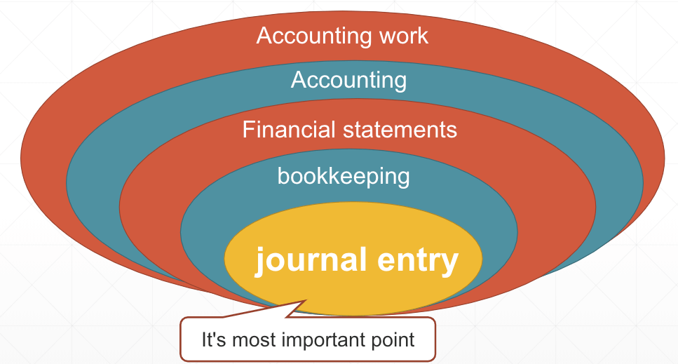
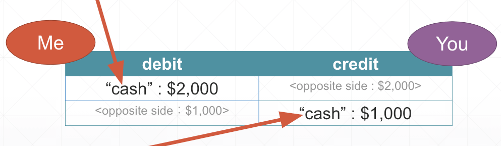
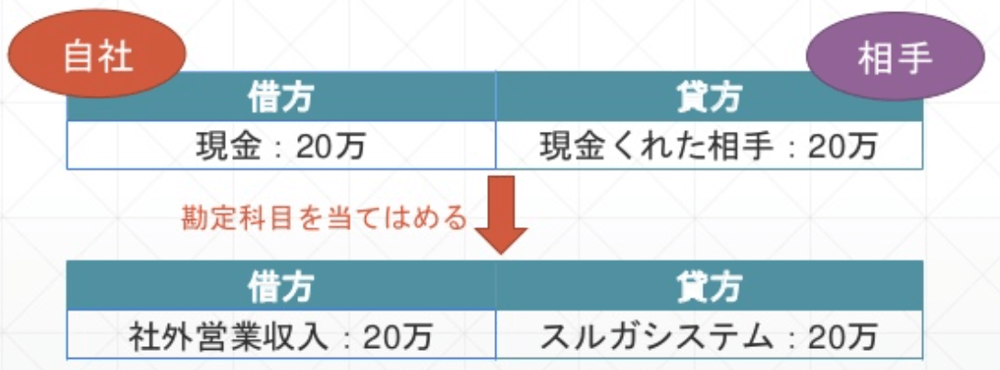
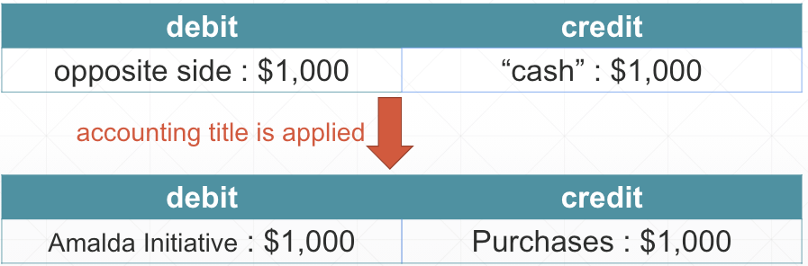

## Accounting for engineers

 
 
 
 
kakisoft
 
&nbsp;&nbsp;

---

## about me

&nbsp;  |  &nbsp;
-------------|---------------
name       | Satoru Kakinohana &nbsp;&nbsp;&nbsp;<small><a href="https://kakisoft-portfolio-v2.netlify.com/">portfolio</a></small>
job        | Software Engineers <small>Specifically Logistics. PHP/JavaScript/AWS etc...</small>  
hobby      | escape room<small>( It is called "リアル脱出ゲーム" in Japan )</small>  
<small>Twitte account</small> | <small>[@kakisoft_tab](https://twitter.com/kakisoft_tab)</small>

 

<small>
cf. escape room is really exciting entertainment.  
You use deductive skill and inspiration and team work, then solve challenging puzzles.</small>

---

## The mission of the work

"We decided to associate with SAP and our system."  

"Create one function that transmit inputted sales and payment data from our system to SAP."  

---

## I had no idea about accouting but...  

  

If I understand journal entry, I can implement the function.  

---

## studied about journal entry

I studied with book and internet.   
but I didn't understand anything about it.  

---

I mean, I didn't know how to apply all the information that I have to system.

---

I felt each authors have many different definitions.

---

## for example, debit and credit

according to some books ..

title | discription
-------------|---------------
はじめての簿記と仕訳       | It has no meaning, Yukichi Fukuzawa named it like so at the first importation.  
世界一やさしい会計の本です           | debit means "ME", and credit means "YOU".  

---

## so that

I figured out each specialists have their own opinion.  

So...  

**I adapted opinion that was easy to understand for me.**  

---

## so, I chose these books.

  
  

author | title
-------------|---------------
Shinya Yamada       | 世界一やさしい会計の本です
^^           | 世界一感動する会計の本です

---

## the reason why I chose

It was easy for me to understand.  

In other books, they divide by accounting title before journal entry.  
But, he uses easier way.  

So, I will tell you that method.  
If you understand it, you can transmit to SAP.  

---

## First of all

debit means **"ME"**  

credit means **"YOU"**  

 

It is the most important point.

---

## basic idea of accounting

There are many accounting titles.  
for example  

 * Checking accounts
 * Finished goods
 * Accounts payable
 * Capital stock

but...  

---

You only focus on **"You got money"** or **"You lost money"**, regaredless of accounting titles.  

---

If you got money, you input amount of money in debit.  

  

If you lost money, you input amount of money in credit.  

---

## case 1 : You got money  

You input that amount to debit.  
And you input your client to credit.  

  

In this case, cash will be named as Sales,
 and client will be the name of actual client.  

---

## case 2 : You lost money  

You input that amount to credit.  
And input your provider to debit.

  

In this case, cash will be named as a Purchases,
 and provider will be the name of actual provider.

---

## about other accounting title

 

Advance payments and transfer are little complicated.  

But, you can apply previous rules basically.  

also, there are some special rules for each companies.  

---

## How to transmit to SAP

 

#### 1st step.
You apply account title to inputted sales and   
payment data from your system.

#### 2nd step.
You extract necessary data.  

#### 3rd step.
You use transmission module.  

That's all  

---

## extra contents

  

I found AMI from SAP in AWS  
I'll try if I feel like it.  

---

fin.
