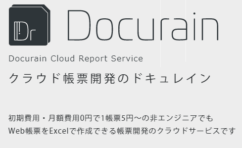

## Amazing Documents Converter Application 'Docurain'

 
 
 
 
kakisoft
 

&nbsp;&nbsp;

---

### about me

&nbsp;  |  &nbsp;
-------------|---------------
name       |Satoru Kakinohana &nbsp;&nbsp;&nbsp;<small>
job        | Software Engineers <small>Specifically Logistics. PHP/JavaScript/AWS etc...</small>
hobby      | escape room
portfolio | [kakisoft-portfolio](https://kakisoft-portfolio-v2.netlify.com)
Twitte | [kakisoft_tab](https://twitter.com/kakisoft_tab)

 

<small>
cf. escape room is called "リアル脱出ゲーム" in Japan. 
It's really exciting entertainment.   
You use deductive skill and inspiration and team work, then solve challenging puzzles.</small>

---

（注意書き）  
このスライドは、私が衝撃を受けた、とあるサービスを紹介する内容です。  

あたかも製品のPRプレゼンのように発表しておりますが、単に発表者がちょっとやってみたかったというのが理由です。  
特に企業の回し者というわけではありません。  

**(Note)**  
I would like to introduce one impressive service in this slide.

It may seems like a sales presentation.  
But, I just love this service. I'm not working for this company.

---

私たちエンジニアは、ドキュメント作成が、とても面倒で大変だと思う事がありませんか？

Have you, as engineers, ever had difficult time making some documents?

---

今日は、皆様に、とても素晴らしいドキュメント作成サービスをご紹介したいと思います。

Today, I would introduce amazing documents converter application 'Docurain'

---

見積書・請求書・発注書・・・

システムによっては、様々なドキュメントを出力する機能が必要なケースがあります。

Estimate, invoice and purchase order ...

Some system is required to print these documents.

---

これらの機能を作る事は、容易ではありません。

It is not easy to create these functions.

---

ドキュメントごとに様々なフォーマットがあり、（開発側サイドとしても）様々なライブラリがあります。

Every single document has totally different and unique format.

Also, we have to choose an appropriate library among many others.

---

このように、帳票を出力する機能を作成するためには、様々な困難があります。

We face many challenges to make some documents download functions.

---

しかし、それをとても簡単に解決できるサービスがあります。

But, there is a simple solution.

---

それが、"Docurain" です。

It is "Docurain".

---

これを使えば、帳票開発の煩わしい作業から、完全に開放されます。

If you use this service, you can be liberated from the annoying document creation tasks.

---

Docurain を使って帳票を作成する機能を開発する時、やる事は、たった２つだけです。

There are only 2 steps to create a function for document creation using Docurain.

---

１つは、帳票のテンプレートを作成する事。

Firstly, create the document template.

  

---

テンプレートの作成は、とても簡単です。  
Excel を使って作成するだけです。  

It is incredibly simple.  
Only tool that you need is Excel.

---

どんな複雑なフォーマットでも思いのままです。

専用のツールや、難しい操作は一切必要ありません。

You have full control to create a complex template. /  
You have a infinite possibility of any kind of complex template.

There is no need of complex operation.

---

もう１つは、API をコールする事。

Lastly, call the API.

---

先ほど作成したテンプレートを指定し、出力したいパラメータをセットしてコールします。

Specify the template, and set the parameters you want to print, and call.

---

もちろん、どんな言語でもOKです。

専用のライブラリのインストールは一切必要ありません

Of course, you can use with any computer languages.

There is no need to install some specific libraries.

---

また、初期費用・月額費用・サポート費用は一切かかりません。

発生する費用は、出力した帳票１毎あたりの金額、５円のみです。

And, there are no initial costs, monthly costs, or support costs.

It costs only 5 yen per document.

---

実際に、どのようなステップでドキュメントが作成されるのか、ご紹介したいと思います。

So, let me show you how to create documents using Docurain.

---

まずは、テンプレートを用意します。

First, prepare your Excel template.

---

このように、Excel に出力用の特別な記述をします。

Like this, fill with specific code.

---

ファイルをアップロードします。

And, upload this file.

---

続いて、APIを用意します。

Next, call the API.

---

テンプレートを指定し、出力するデータを json形式で記述します。

Choose the template, and set the parameter as json object.

---

実行ボタンを押すと、資料がダウンロードできます。

Click execute button, document will be downloaded.

---

もちろん、ソースコードから実行する事も出来ます。

Needless to say, you can call the API from source code.

---

このように、とても簡単にドキュメント作成機能を作成する事が出来ます。

As you can see, you can easily create document function.

---

あなたの仕事を簡単にしてみませんか？

Why don't you make your work easy?

---

詳しい情報は、公式サイトをご参照ください

If you want to get more information, please visit official website.

（QRコード）

---

帳票出力機能の開発にわずらわしさを感じている企業からのご連絡をお待ちしております。

We are looking forward to hearing from the companies that find document creation frustrating.

---

※注意※

重ね重ね言いますが、発表者は Docurain 社の人間ではなく、本スライドは製品のPRスライドでもありません。

本当に本当に ITエンジニアのLTイベント用に作成したものです。

**!!!Caution!!!**

Let me repeat that, I'm not from Docurain company neither this slide is production advertizement.

It is truly truly for this event for IT engineers.

---

(Thank you for listing)

---

---

---

「このように」 -> 英語だとあまり入らない表現となる

report - 報告書
document - 資料全般

