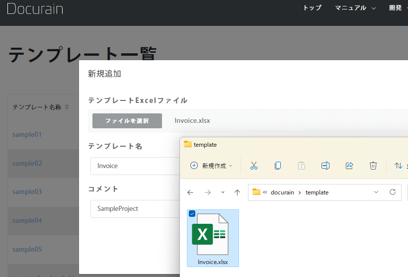
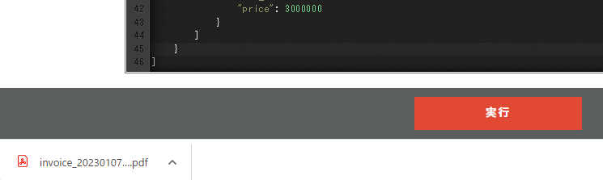

### 使いやすすぎてヤバい ドキュメント作成サービス  'Docurain'

 
 
 
 
kakisoft
 

&nbsp;&nbsp;

---

### about me

&nbsp;  |  &nbsp;
-------------|---------------
名前       | 垣花　暁 &nbsp;&nbsp;&nbsp;<small>
仕事        | 物流系エンジニア <small>Laravel/React/AWS etc...</small>  
趣味      | リアル脱出ゲーム
ポートフォリオ | [kakisoft-portfolio](https://kakisoft-portfolio-v2.netlify.com)
Twitte | [@kakisoft_tab](https://twitter.com/kakisoft_tab)

---

**（前置き）**  
このスライドは、私が衝撃を受けた、とあるサービスを紹介する内容です。  

あたかも製品のPRプレゼンのように発表しておりますが、単に発表者がちょっとやってみたかったというのが理由です。  
特に企業の回し者というわけではありません。  

---

私たちエンジニアは、ドキュメント作成が、とても面倒で大変だと思う事がありませんか？

---

今日は、皆様に、とても素晴らしいドキュメント作成サービスをご紹介したいと思います。

---

見積書・請求書・発注書・・・

システムによっては、様々なドキュメントを出力する機能が必要なケースがあります。

---

これらの機能を作る事は、容易ではありません。

---

ドキュメントごとに様々なフォーマットがあり、（開発側サイドとしても）様々なライブラリがあります。

---

このように、帳票を出力する機能を作成するためには、様々な困難があります。

---

しかし、それをとても簡単に解決できるサービスがあります。

---

それが、"Docurain" です。

  

---

これを使えば、帳票開発の煩わしい作業から、完全に開放されます。

---

Docurain を使って帳票を作成する機能を開発する時、やる事は、たった２つだけです。

---

１つは、帳票のテンプレートを作成する事。

  

---

テンプレートの作成は、とても簡単です。  
Excel を使って作成するだけです。  

  

---

どんな複雑なフォーマットでも思いのままです。

専用のツールや、難しい操作は一切必要ありません。

---

もう１つは、API をコールする事。

---

先ほど作成したテンプレートを指定し、出力したいパラメータをセットしてコールします。

---

もちろん、どんな言語でもOKです。

専用のライブラリのインストールは一切必要ありません

---

また、初期費用・月額費用・サポート費用は一切かかりません。

発生する費用は、出力した帳票１毎あたりの金額、５円のみです。

---

実際に、どのようなステップでドキュメントが作成されるのか、ご紹介したいと思います。

---

まずは、テンプレートを用意します。

  

---

このように、Excel に出力用の特別な記述をします。

  

---

ファイルをアップロードします。

  

---

続いて、APIを用意します。

---

テンプレートを指定し、出力するデータを json形式で記述します。

---

実行ボタンを押すと、資料がダウンロードできます。

  

---

このように作成する事が出来ます。

  

---

もちろん、ソースコードから実行する事も出来ます。

  

---

このように、とても簡単にドキュメント作成機能を作成する事が出来ます。

---

あなたの仕事を簡単にしてみませんか？

---

詳しい情報は、公式サイトをご参照ください

[https://docurain.jp/](https://docurain.jp/)

---

帳票出力機能の開発にわずらわしさを感じている企業からのご連絡をお待ちしております。

---

※注意※

重ね重ね言いますが、発表者は Docurain 社の人間ではなく、本スライドは製品のPRスライドでもありません。

本当に本当に ITエンジニアのLTイベント用に作成したものです。

---

おわり