## AWS – ALB基礎 ～ロードバランサーの役割と構築について～

 
 
 
 
kakisoft
 

&nbsp;&nbsp;

---

## 趣旨

AWS ALB について、色々触ってみたので、シェアしておきたい。

デモ環境も用意したので、ただ説明するだけでなく実際にアクセス
できるようにしているので、挙動も併せて説明したい。

以下の事ができたので、実際の設定内容を含めて資料化した。
・EC2 を２台使用して、負荷を分散
・ALB にてサブドメインを適用（バーチャルホスト）
・ACMを使用して HTTPS化

---

## ロードバランサーとは？

 * 複数のサーバにリクエストを自動で振り分ける装置（サービス）。
 * 単一のサーバに頼らないため、サーバが１台落ちても、サービスが停止しない。
 * アクセス数が増えた時、サーバを増やして対応できる。

---

## ALB（Application Load Balancer）の特徴

 * AWSが提供するマネージド型ロードバランサー
 * 第7層（アプリケーション層）で動作する。
 * URL、ホスト名、ヘッダなどで振り分けが可能
 * SSL証明書（ACM）と組み合わせてHTTPS化できる。
 * 自動でヘルスチェックを実行し、異常なサーバを除外できる。

---

## デモの構成について

---

## 今回の構成

 * EC2（２台） Ubuntu 24
　　Webサーバ：nginx ー 簡単なWebページを表示
 * ALB（ Application Load Balancer ）
　　リクエストの分散
 * Route53
　　ALBとドメインを紐付け
 * ACM（ AWS Certificate Manager ）
　　AWSが提供している無料の SSL証明書。HTTPS化。
　　（Webサーバでなく、ALBに証明書を適用する。また、 Let’s Encrypt は直接使えない）

---

## 設定内容

---

## 今回の手順

1. EC2 を作成
2. ALBに適用するセキュリティグループを作成
3. ターゲットグループの作成
4. ロードバランサーの作成
5. EC2 のセキュリティグループ設定
6. Route 53 設定
7. ALBに ACM（証明書）を適用。（HTTPS化）
8. nginx 設定

---

## 今回の手順

1. EC2 を作成
2. ALBに適用するセキュリティグループを作成
3. ターゲットグループの作成
4. ロードバランサーの作成
5. EC2 のセキュリティグループ設定
6. Route 53 設定
7. ALBに ACM（証明書）を適用。（HTTPS化）
8. nginx 設定

---

## 1. EC2 を作成

最小限の構成でALBの挙動が確認できるように準備する。
t4g.nano を 2台。Ubuntu 24 を使用する。
（本題はALB構築のため、EC2の詳細設定は省略）

今回は、以下の２台を EC2 インスタンスを作成
・elb-ec2-sample01-a-u01
・elb-ec2-sample01-a-u02

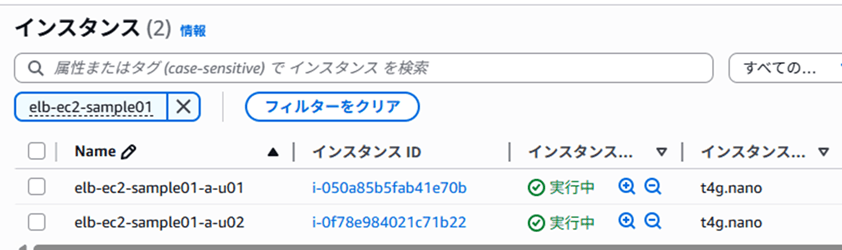

---

## 今回の手順

1. EC2 を作成
2. ALBに適用するセキュリティグループを作成
3. ターゲットグループの作成
4. ロードバランサーの作成
5. EC2 のセキュリティグループ設定
6. Route 53 設定
7. ALBに ACM（証明書）を適用。（HTTPS化）
8. nginx 設定

---

## 2. ALBに適用するセキュリティグループを作成

ALB はインターネットからアクセスを受け付けるため、HTTP/HTTPSポート（80と443）を開放する。

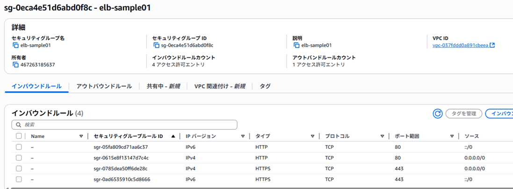

---

## 今回の手順

1. EC2 を作成
2. ALBに適用するセキュリティグループを作成
3. ターゲットグループの作成
4. ロードバランサーの作成
5. EC2 のセキュリティグループ設定
6. Route 53 設定
7. ALBに ACM（証明書）を適用。（HTTPS化）
8. nginx 設定

---

## 3. ターゲットグループの作成 – (1)

### ターゲットグループとは

ALBがリクエストを振り分ける先（＝EC2など）を
まとめたグループ。

### ターゲットグループの役目
・ALBは直接 EC2 を指定しない。
・「ターゲットグループ」という単位で登録された
　複数のサーバに振り分ける。
・EC2の死活監視（ヘルスチェック）も
　ターゲットグループ単位で行われる

---

## 3. ターゲットグループの作成 – (2)

EC2 の画面にて、「ターゲットグループ」のメニューを選択し、
「ターゲットグループの作成」をクリック。

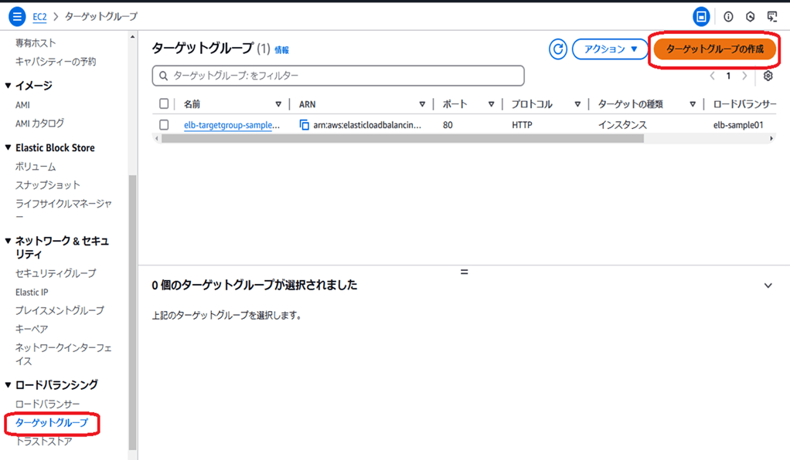

---

## 3. ターゲットグループの作成– (3)

EC2 を指定する場合、「インスタンス」を選択

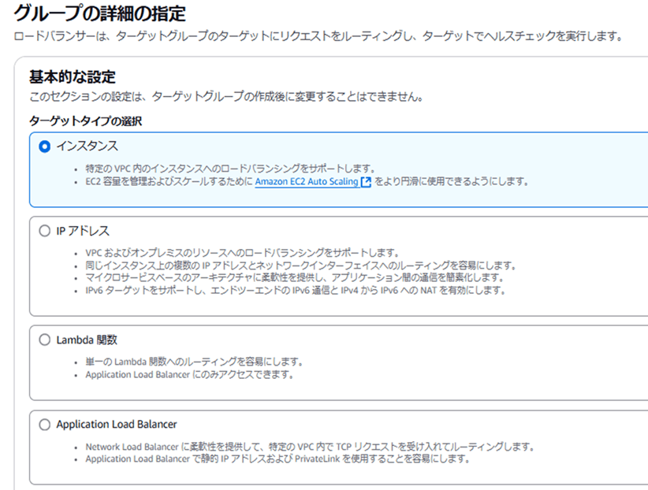

---

## 3. ターゲットグループの作成– (4)

・ターゲットグループ名を設定。
・プロトコル：ポートを選択。
HTTPS でアクセスを受け付ける場合でも、ここは「HTTP」でOK。
（HTTPS化は ELB で実施。ELB → EC2 への通信は HTTP で実施するため、ここは HTTPで問題なし。）

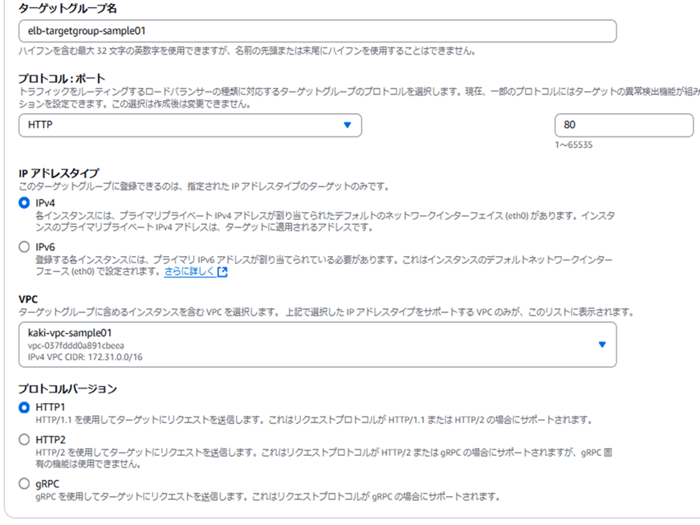

---

## 3. ターゲットグループの作成– (5)

ヘルスチェック用のエンドポイントがあれば、
それを設定できる。（死活監視）

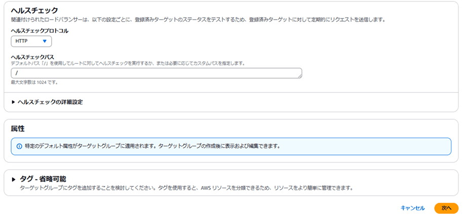

---

## 3. ターゲットグループの作成– (6)

対象となる EC2 を選択し、
「保留中として以下を含める」をクリック

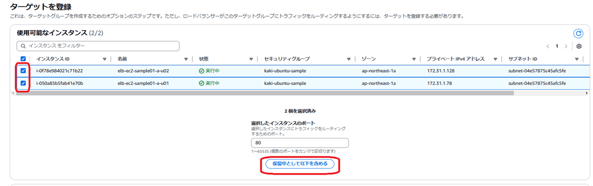

---

## 3. ターゲットグループの作成– (7)

EC2 ２台の構成のターゲットグループが作成される

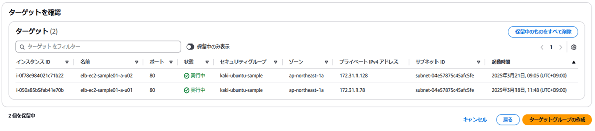

---

## 今回の手順

1. EC2 を作成
2. ALBに適用するセキュリティグループを作成
3. ターゲットグループの作成
4. ロードバランサーの作成
5. EC2 のセキュリティグループ設定
6. Route 53 設定
7. ALBに ACM（証明書）を適用。（HTTPS化）
8. nginx 設定

---

## 4. ロードバランサーの作成 – (1)

EC2 の画面にて、「ロードバランサー」のメニューを選択し、
「ロードバランサーの作成」をクリック。

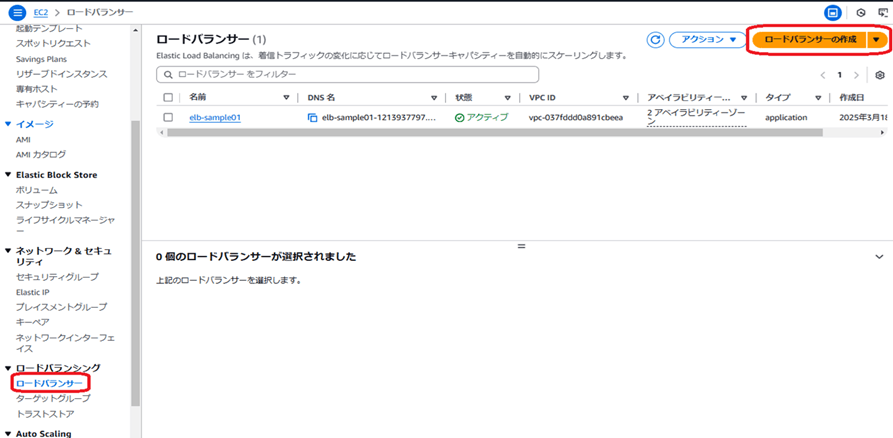

---

## 4. ロードバランサーの作成 – (2)

ロードバランサ―タイプにて、「Application Load Balancer」
を選択。

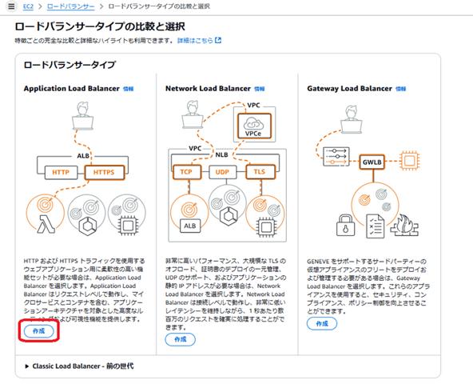

---

## 4. ロードバランサーの作成 – (3)

ロードバランサー名を設定

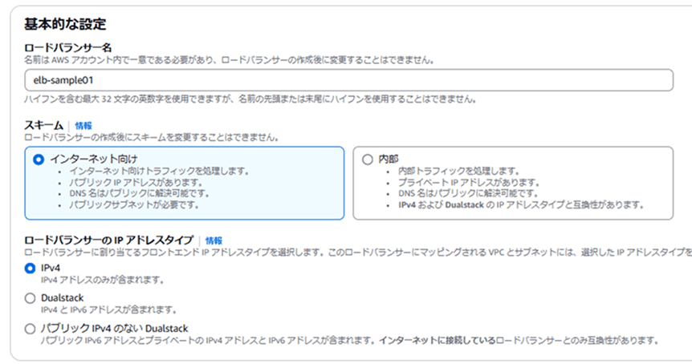

---

## 4. ロードバランサーの作成 – (4)

ネットワークの設定をする。（VPC等）
ALBはインターネットからアクセスされる前提のため、パブリックサブネットに配置する。

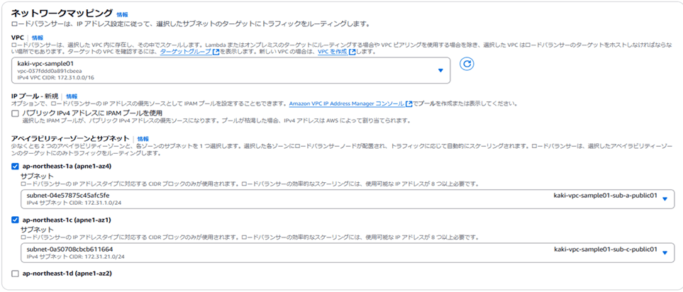

---

## 4. ロードバランサーの作成 – (5)

セキュリティグループ設定
手順「２．ALBに適用するセキュリティグループを作成」
にて作成したセキュリティグループを適用する。

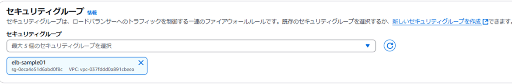

---

## 4. ロードバランサーの作成 – (6)

ルーティング設定
手順「３．ターゲットグループの作成」
にて作成したターゲットグループを適用する。

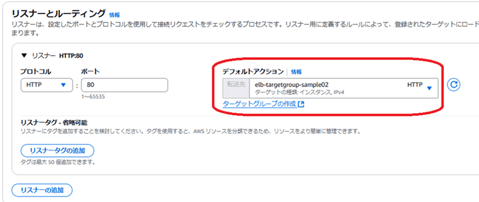

---

## 4. ロードバランサーの作成 – (7)

HTTPSアクセスを受け付ける場合、
プロトコルに HTTPSを選択する。

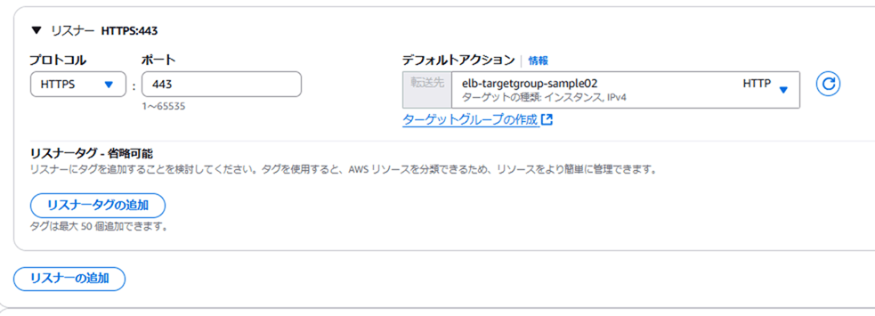

---

## 4. ロードバランサーの作成 – (8)

証明書の取得先は「ACMから」を選択する。
（証明書の詳細については後述します。）

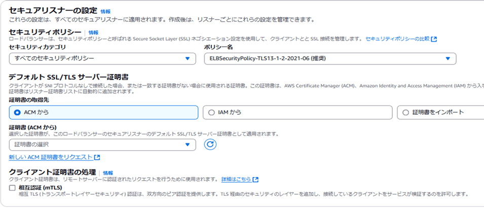

---

## 4. ロードバランサーの作成 – (9)

「ロードバランサ―の作成」をクリック。

ロードバランサ―が作成される。

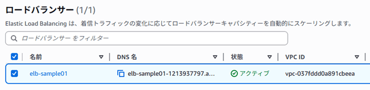

---

## 今回の手順

1. EC2 を作成
2. ALBに適用するセキュリティグループを作成
3. ターゲットグループの作成
4. ロードバランサーの作成
5. EC2 のセキュリティグループ設定
6. Route 53 設定
7. ALBに ACM（証明書）を適用。（HTTPS化）
8. nginx 設定

---

## 5. EC2 のセキュリティグループ設定

ALBからEC2へリクエストを中継するには、EC2側でHTTPを受け入れる必要がある
ただし、インターネット全体からのアクセスは不要
ALBのセキュリティグループだけを許可するのが安全。（最小構成）

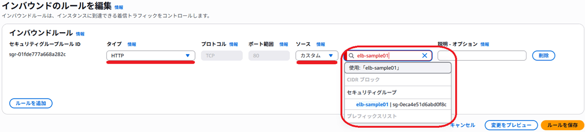

---

## 今回の手順

1. EC2 を作成
2. ALBに適用するセキュリティグループを作成
3. ターゲットグループの作成
4. ロードバランサーの作成
5. EC2 のセキュリティグループ設定
6. Route 53 設定
7. ALBに ACM（証明書）を適用。（HTTPS化）
8. nginx 設定

---

## 6. Route 53 設定 – (1)

### Aレコードの設定について

ALBを使用する時、Aレコードの設定内容が異なる。
IPアドレスではなく、ALB名を指定する。
（「エイリアスレコード (Alias Record)」 という特別な仕組みを提供している。
通常の A レコードとは異なり、DNS 名 (例: dualstack.elb-xxxx.elb.amazonaws.com) に直接紐づけることができる。）

---

## 6. Route 53 設定 – (2)

Aレコード設定時、「エイリアス」をONにすると、
ALBを選択できる。

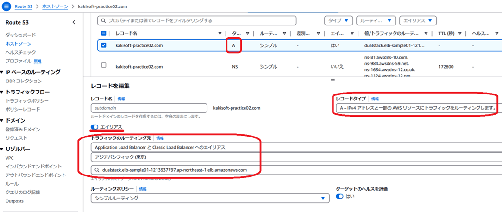

---

## 6. Route 53 設定 – (3)

サブドメインも同様

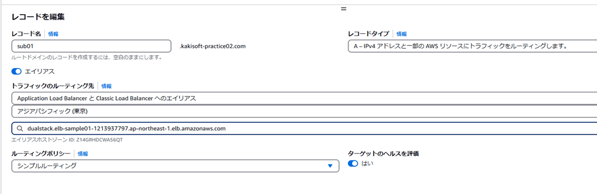

---

## 今回の手順

1. EC2 を作成
2. ALBに適用するセキュリティグループを作成
3. ターゲットグループの作成
4. ロードバランサーの作成
5. EC2 のセキュリティグループ設定
6. Route 53 設定
7. ALBに ACM（証明書）を適用。（HTTPS化）
8. nginx 設定

---

## ALBに ACM（証明書）を適用。（HTTPS化）- (1)

### ACM（AWS Certificate Manager）とは？
・SSL証明書を無料で発行・管理できるAWSのサービス
・SSL証明書の更新が自動化される。（AWSのみで完結できる）
・一部のサービスのみで適用可能。
・EC2 には適用できない。

### ACMが適用可能なサービス
・ALB（Application Load Balancer）
・CloudFront
・API Gateway
・Elastic Beanstalk

---

## ALBに ACM（証明書）を適用。（HTTPS化）- (2)

AWSの「ACM」を選択。
「証明書をリクエスト」をクリック。

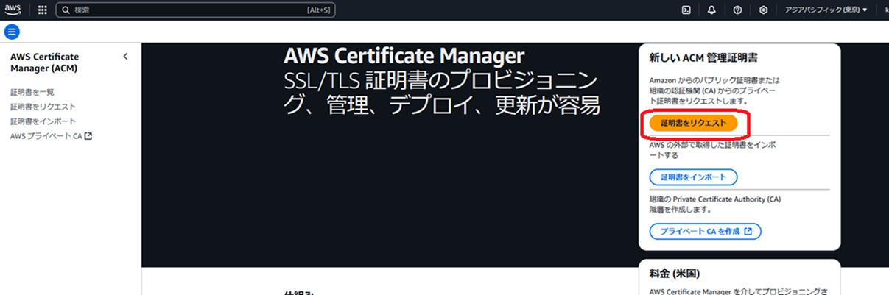

---

## ALBに ACM（証明書）を適用。（HTTPS化）- (3)

『検証方法』は、「DNS検証」を選択。
「リクエスト」をクリック。

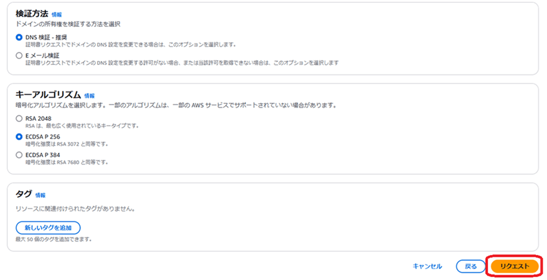

---

## ALBに ACM（証明書）を適用。（HTTPS化）- (4)

証明書のステータス画面に遷移する

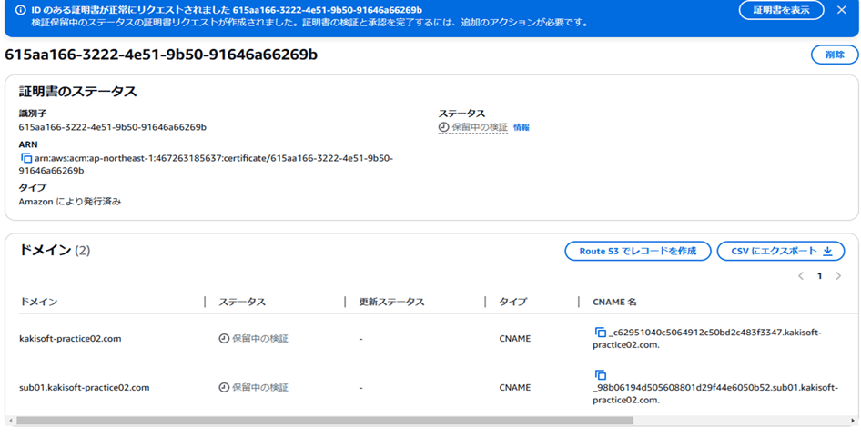

---

## ALBに ACM（証明書）を適用。（HTTPS化）- (5)

「Route53 でレコードを作成」をクリック。

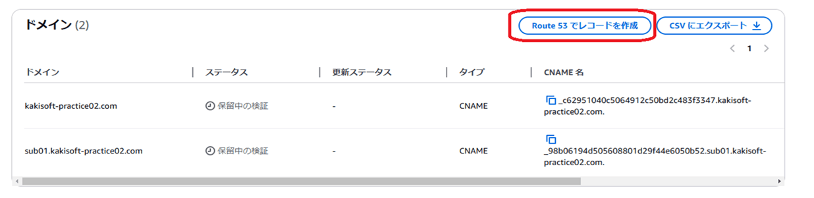

---

## ALBに ACM（証明書）を適用。（HTTPS化）- (6)

ドメインを指定する。
サブドメインもまとめて選択できる。
選択後、「レコードの作成」をクリック。

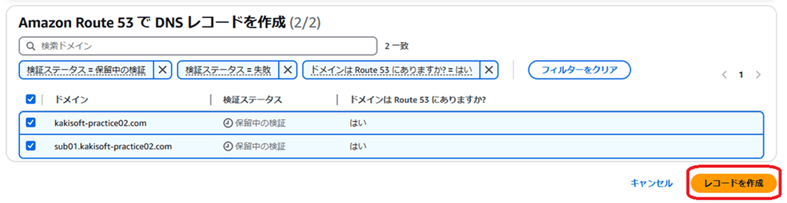

---

## ALBに ACM（証明書）を適用。（HTTPS化）- (7)

SSL証明書が適用される。

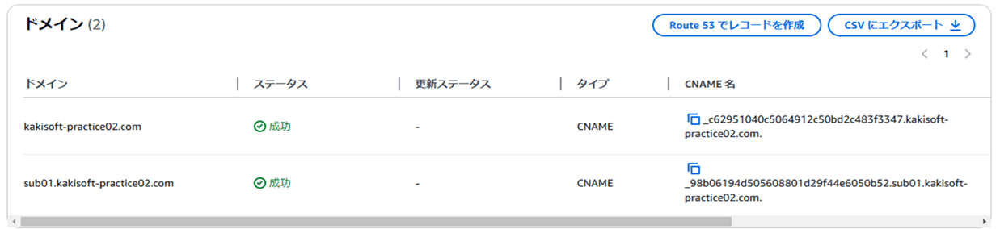

---

## 今回の手順

1. EC2 を作成
2. ALBに適用するセキュリティグループを作成
3. ターゲットグループの作成
4. ロードバランサーの作成
5. EC2 のセキュリティグループ設定
6. Route 53 設定
7. ALBに ACM（証明書）を適用。（HTTPS化）
8. nginx 設定

---

## nginx 設定 – (1)

Webサーバ（EC2）側のリッスンポートは、80 のみでOK。
（EC2 は ALBからのアクセスのみを受け付けるので、
HTTPS で受け付ける必要は無い。）

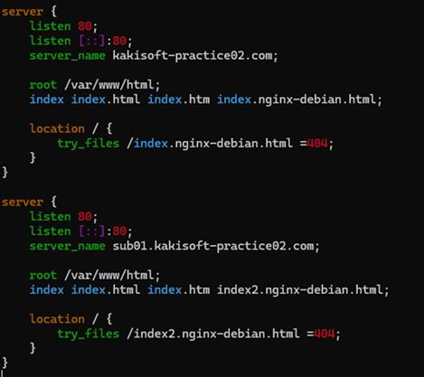

サブドメインも
通常通り記述する。

---

## nginx 設定 – (2)

今回、「どこのサーバに接続されたか」という事を可視化できるように、各サーバの出力内容を少し変えています。

EC2 ：elb-ec2-sample01-a-u01 の内容

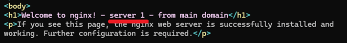

EC2 ：elb-ec2-sample01-a-u02 の内容

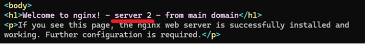

---

## デモ

https://kakisoft-practice02.com/

https://sub01.kakisoft-practice02.com/

ページを何度かリロードすると、表示内容が切り替わります。
（接続先が振り分けられます。）

※ページは予告なく削除される事があります

---

## ALBを使う上での注意点

---

## 注意点

1. アクセス元のIPアドレスの取得について
2. EC2 への設定変更について
3. セッション管理について

---

## 注意点

1. アクセス元のIPアドレスの取得について
2. EC2 への設定変更について
3. セッション管理について

---

## アクセス元のIPアドレスの取得について – (1)

ロードバランサを使わない場合、$remote_addr で、
アクセス元のユーザのIPアドレスを取得できる。

---

## アクセス元のIPアドレスの取得について – (2)

---

## アクセス元のIPアドレスの取得について – (3)

---

## アクセス元のIPアドレスの取得について – (4)

---

## アクセス元のIPアドレスの取得について – (5)

---

## アクセス元のIPアドレスの取得について – (6)

---

## 注意点

1. アクセス元のIPアドレスの取得について
2. EC2 への設定変更について
3. セッション管理について

---

## 注意点

1. アクセス元のIPアドレスの取得について
2. EC2 への設定変更について
3. セッション管理について

---

## 

a

---

## 

a

---

## 

a

---

## 

a

---

## 

a

