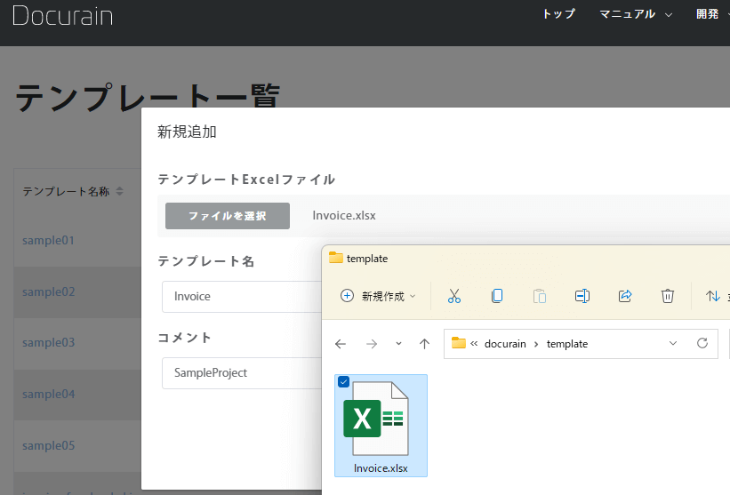
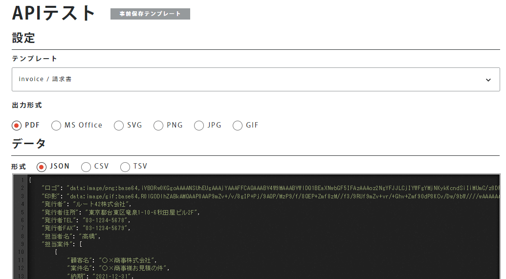
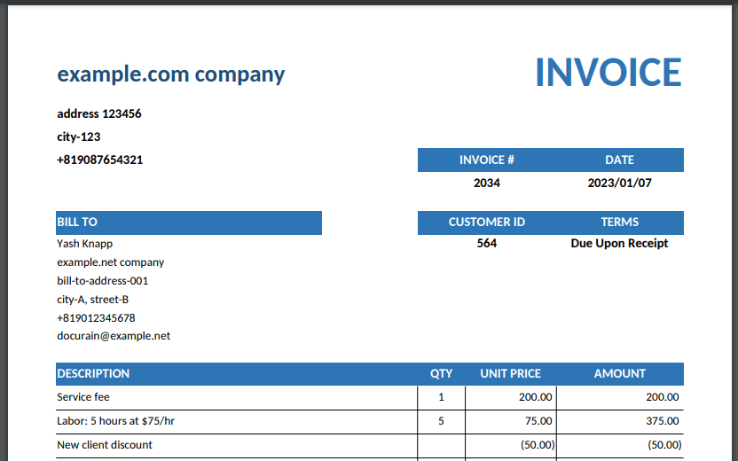

## Amazing Documents Converter Application 'Docurain'

 
 
 
 
kakisoft
 

&nbsp;&nbsp;

---

### about me

&nbsp;  |  &nbsp;
-------------|---------------
name       |Satoru Kakinohana &nbsp;&nbsp;&nbsp;<small>
job        | Software Engineers <small>Specifically Logistics. PHP/JavaScript/AWS etc...</small>
hobby      | escape room
portfolio | [kakisoft-portfolio](https://kakisoft-portfolio-v2.netlify.com)
Twitte | [kakisoft_tab](https://twitter.com/kakisoft_tab)

 

<small>
cf. escape room is called "リアル脱出ゲーム" in Japan. 
It's really exciting entertainment.   
You use deductive skill and inspiration and team work, then solve challenging puzzles.</small>

---

**(Note)**  
I would like to introduce one impressive service in this slide.

It may seems like a sales presentation.  
But, I just love this service. I'm not working for this company.

---

Have you, as engineers, ever had difficult time making some documents?

---

Today, I would introduce amazing documents converter application 'Docurain'

---

Estimate, invoice and purchase order ...

Some system is required to print these documents.

---

It is not easy to create these functions.

---

Every single document has totally different and unique format.

Also, we have to choose an appropriate library among many others.

---

We face many challenges to make some documents download functions.

---

But, there is a simple solution.

---

It is "Docurain".

  

---

If you use this service, you can be liberated from the annoying document creation tasks.

---

There are only 2 steps to create a function for document creation using Docurain.

---

Firstly, create the document template.

  

---

It is incredibly simple.  
Only tool that you need is Excel.

  

---

You have full control to create a complex template.

There is no need of complex operation.

---

Lastly, call the API.

---

Specify the template, and set the parameters you want to print, and call.

---

Of course, you can use with any computer languages.

There is no need to install some specific libraries.

---

And, there are no initial costs, monthly costs, or support costs.

It costs only 5 yen per document.

---

So, let me show you how to create documents using Docurain.

---

First, prepare your Excel template.

  

---

Like this, fill with specific code.

  

---

And, upload this file.

  

---

Next, call the API.

---

Choose the template, and set the parameter as json object.

  

---

Click execute button, document will be downloaded.

  

---

You can create such document.

  

---

Needless to say, you can call the API from source code.

  

---

As you can see, you can easily create document function.

---

Why don't you make your work easy?

---

If you want to get more information, please visit official website.

[https://docurain.jp/](https://docurain.jp/)

---

We are looking forward to hearing from the companies that find document creation frustrating.

---

**!!!Caution!!!**

Let me repeat that, I'm not from Docurain company neither this slide is production advertizement.

It is truly truly for this event for IT engineers.

---

fin.
