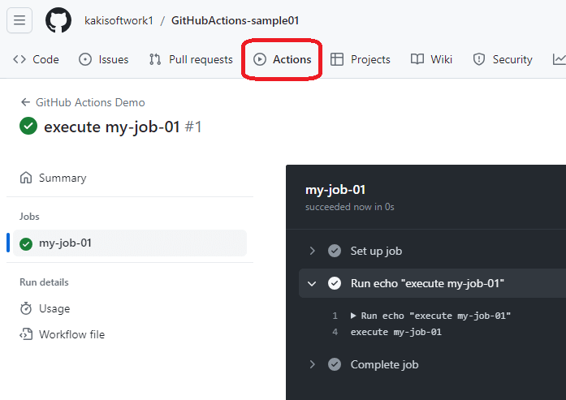
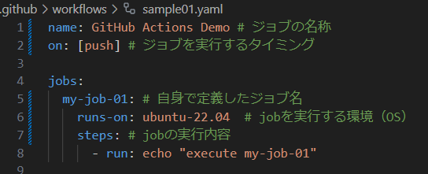

### GitHub Actions の使い方とハマリどころについて

 
 
 
 
kakisoft
 

&nbsp;&nbsp;

---

## GitHub Actions とは

GitHub 公式の CI/CD の仕組み。  

コードの変更やプッシュが行われたときに、特定のワークフローを自動的に実行できる。  

---

## 使い方

---

.github/workflows ディレクトリに、yamlファイルを配置。  

---

こんな感じでジョブが動く。  

---

使うだけなら超簡単。  

しかし、やりたい事を実現させるには、結構変なハマり所もある。  

---

## 今回実現したい事

---

## _

---

## _

---

## _

---

## _

---

## _

---

## _

---

## _

---

## _

---

## _

---

## _

---

## _

---

## _

---

## _

---

## _

---

## _

---

## _

---

## _

---

## _

---

## _

---

## _

---

おわり