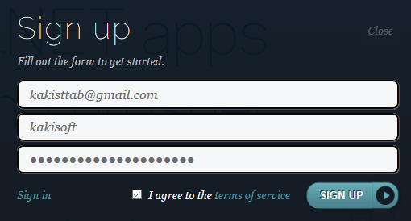
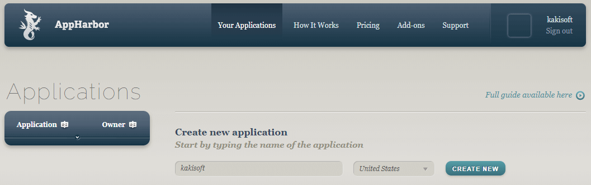
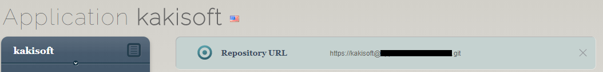

### AppHarborを使って .NETアプリを無料デプロイ！

 
 
 
 
kakisoft
 

&nbsp;&nbsp;

---

### about me

&nbsp;  |  &nbsp;
-------------|---------------
名前       | 垣花　暁 &nbsp;&nbsp;&nbsp;<small>
仕事        | 物流系エンジニア <small>Laravel/React/AWS etc...</small>  
趣味      | リアル脱出ゲーム
ポートフォリオ | [kakisoft-portfolio](https://kakisoft-portfolio-v2.netlify.com)
Twitte | [kakisoft_tab](https://twitter.com/kakisoft_tab)

---

今回、ご紹介するのは、  
「AppHarbor」というサービスについてです。  

https://appharbor.com/  

---

### AppHarbor
 

簡単に言えば.NET版 Heroku。  
無料枠がある。

---

### Heroku
 

超ざっくり言うと、git push するだけで  
デプロイが完了するサービス。  
　  
サーバやインフラを考えずに、  
アプリを公開できる。  
　  
無料枠がある。

---

簡単な使い方

---

ユーザ登録  
  

---

リポジトリ作成  
  

---

push先のURLが生成される。  
  

---

プロジェクト作成後、push  
  

---

管理画面にてデプロイ。  
  

---

こんな感じ。  
  
http://kakisoft.apphb.com/Home/

---

様々なプラグインがあります。  
  

---

.NET Coreも対応済み。  
  
https://support.appharbor.com/discussions/problems/91707-does-appharbor-support-aspnet-core-v11-applications#comment_43189226  

---

個人開発アプリのデプロイ先の候補として  
いかがでしょう？  
（Azureの無料枠は期限付きなので・・・）

---

ただし、無料で公開できる枠は１つだけです。  
　  
複数公開したい場合は、複数アカウントを作成するなどの対応が必要となります。  
　  
※クレジットカードの登録は不要です

---

おわり