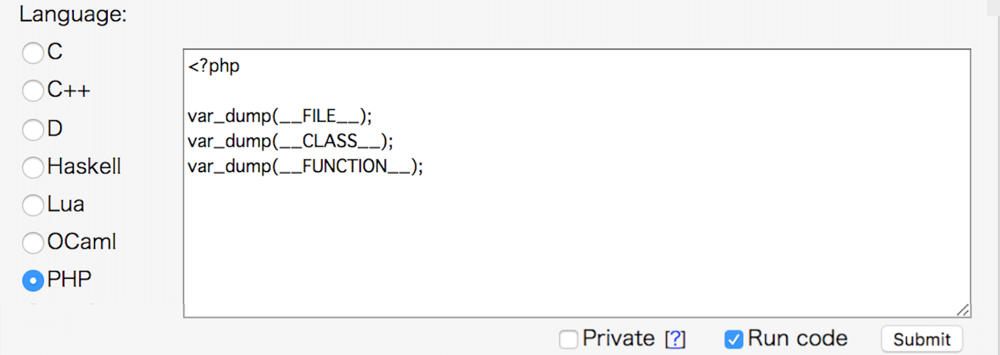

### お手軽に使う PHP

<br>
<br>
<br>
<br>
kakisoft
<br>

&nbsp;&nbsp;

---

### about me

&nbsp;  |  &nbsp;
-------------|---------------
名前       | 垣花　暁 &nbsp;&nbsp;&nbsp;<small>
仕事        | 物流系エンジニア<br><small>Laravel/React/AWS etc...</small>  
趣味      | リアル脱出ゲーム
ポートフォリオ | [kakisoft-portfolio](https://kakisoft-portfolio-v2.netlify.com)
Twitte | [kakisoft_tab](https://twitter.com/kakisoft_tab)

---

PHPを使い始める時の環境って、  
どんな感じなのでしょう？

---

次のような感じが  
多いんじゃないかと思ってます。

---

 * 社内で整備した環境  
 （シェルスクリプト/Chef/Ansible で用意）
 * 公式の仮装環境（Vagrant/Docker）
 * カスタマイズした仮装環境（同）

---

ゼロから始める場合、仮装環境は、  
特定フレームワークの公式イメージや  
ボックスをベースにする事が  
多いんじゃないかと思います。

---

既に稼動中のプロダクトに途中から参画する場合、  
動作に必要なアプリ、パッケージ、ミドルウェアが  
用意されている事が多いのではないでしょうか。

---

そんな感じで、  
　  
「PHPを軽く使う」  
　  
という状況が、生まれにくく  
なっているんじゃないかと思いました。

---

というわけで、  
プロダクトでがっつり使う事は  
とりあえず置いといて、  
PHPをお手軽に使う方法について  
スポットを当ててみました。

---

### コンソールから実行する

---

#### 実行例

ファイル：「 console.php 」
```php
<?php
$message = "Hello World";

echo $message;
```

コンソールより実行。
```
$ php console.php
Hello World
```

---

### ビルトインサーバ

---

ApacheやNginxといった  
Webサーバを用意せず、  
PHP付属の物を使う。

---

#### 実行例

```
＜起動＞
php -S localhost:8000

＜終了＞
Ctrl + C
```
　  
以下のように起動すると、外部からアクセスできる。
```
＜起動（外部からアクセス可）＞  
php -S 0.0.0.0:8000

```

---

##### 例
ファイル名：「buildinserver.php」
```php
<?php var_dump($_POST["textbox01"]); ?>
<!DOCTYPE html>
<html lang="ja"><head><meta charset="utf-8"></head>
<body>
  <form action="" method="POST">
    <input type="text" name="textbox01" value="<?php echo $_POST["textbox01"]?>">
    <input type="submit" value="submit!!">
  </form>
</body>
</html>
```
```
php -S localhost:8000
```
```
http://localhost:8000/buildinserver.php
```

---

実行結果、こんな感じ。  
  

---

### 対話形式

---

コンソールにて ``` php -a ``` を入力すると、  
対話形式で実行できる。
```
$ php -a
Interactive shell

php > echo "hello";
hello
```

PHP 5.1.0 以降で使用可。  
タブ補完が効く。  

---

### ブラウザから使用１
### Ideone

---

Ideone というサービスにて、  
ブラウザに PHPのコードを入力して実行できる。  
https://ideone.com/  

  
　
速度はあんまり早くない。

---

### ブラウザから使用２
### codepad

---

codepad というサービスにて、  
ブラウザに PHPのコードを入力して実行できる。  
http://codepad.org/
　  　    
  
　
結構サクサク動く。ローカルにPHPが  
入ってない場合は、いいかもしんない。

---

こんな感じで、お手軽にPHP使う事もできます。

---

大規模開発からちょっと離れて、  
軽く触れてみるのはどうでしょう。

---

おわり
