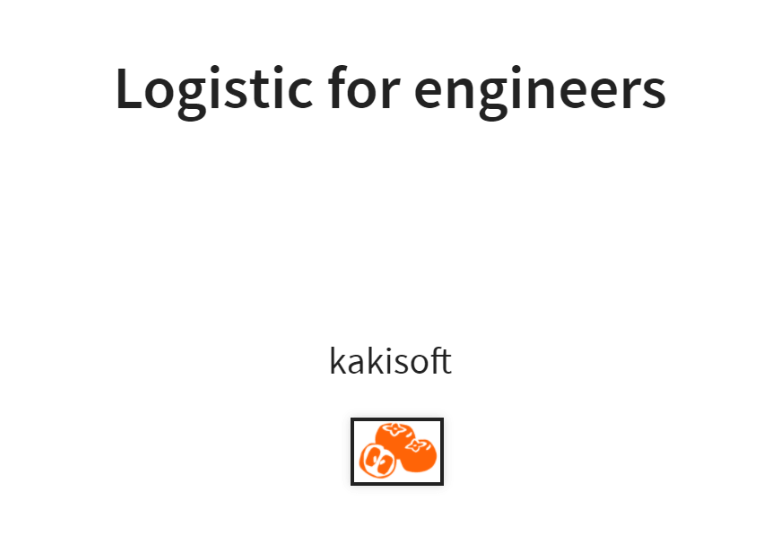
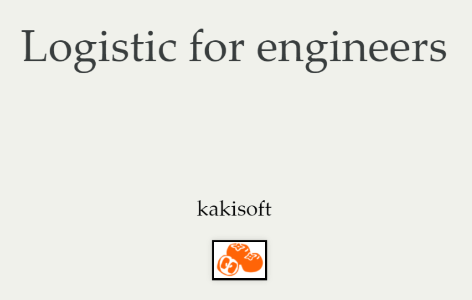
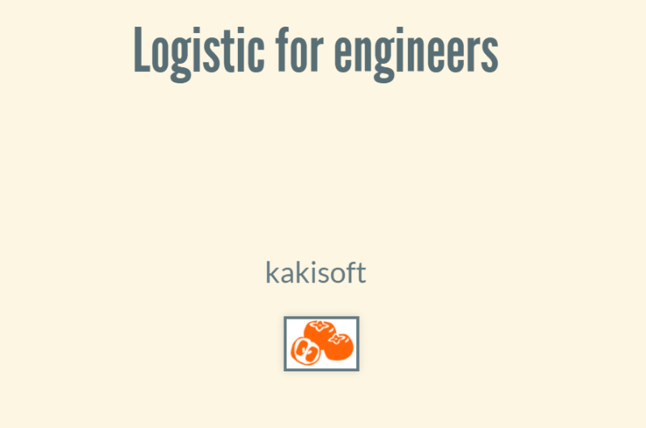

## vscode-reveal
https://marketplace.visualstudio.com/items?itemName=evilz.vscode-reveal


## ビルド
```
command + shift + P → Rrevealjs: Export in HTML.
```


## vscode にてプレビュー
```
左メニューの vscode-reveal のアイコンをクリック → 上段のアイコン（分割しているようなアイコン）をクリック
```


## ブラウザにてプレビュー
```
コマンドパレットで [reveal] を検索

Open presentation in browser
```

____________________________________________________________________
____________________________________________________________________
____________________________________________________________________
## vscode-reveal : sample
https://raw.githubusercontent.com/evilz/vscode-reveal/master/sample.md


## reveal.js
https://revealjs.com/
https://revealjs.com/markup/


## reveal.js(GitHub)
https://github.com/hakimel/reveal.js/blob/master/README.md


## reveal.jsのREADME.mdを翻訳してみた
https://qiita.com/hilohiro/items/eab479f6dcf4a100e31b


## 【スライド】 非エンジニアのためのお手軽reveal.js入門
https://jyun76.github.io/revealjs-vscode/


## 【スライド】 REVEAL.JS
https://www.w3.org/2013/06/revealjs/#/

## 参考

#### これからのプレゼン資料は reveal.js を使おう
https://qiita.com/Targityen/items/40ae4795e2cb77c1adc6  

#### Visual Studio Code の拡張機能「vscode-reveal」で reveal.js を使ってみる
https://qiita.com/myname6c7c2/items/1d8c434f14dfe8f273a6  


____________________________________________________________________
____________________________________________________________________
____________________________________________________________________
# header config

|  プロパティ                 |  値                                    |  説明                                                               |
|:-----------------------|:--------------------------------------|:------------------------------------------------------------------|
|  controls              |  true/false                           |  スライド移動用の矢印の表示有無を設定します。                                           |
|  controlsLayout        |  bottom-right/edges                   |  スライド移動用の４方向の矢印を右下に表示する（bottom-right）か、各方向の端に表示するか（edges）を設定します。  |
|  slideNumber           |  true/false                           |  スライドページ番号の表示有無を設定します。                                            |
|  history               |  true/false                           |  ブラウザの履歴を有効にするかを設定します。                                            |
|  keyboard              |  true/false                           |  キー操作の有無を設定します。                                                   |
|  showNotes             |  true/false                           |  全スライドにノートを表示するかを設定します。                                           |
|  autoSlide             |  数値（デフォルト：0）                          |  スライドを自動で移動する際の時間（1000: 1s）を設定します。0の場合は自動移動しません。                  |
|  autoSlideStoppable    |  true/false                           |  スライドを自動で移動させる場合に、停止ボタンの表示有無を設定します。                               |
|  mouseWheel            |  true/false                           |  マウスホイール操作の有無を設定します。                                              |
|  transitionSpeed       |  default/fast/slow                    |  スライドの移動速度を設定します。                                                 |
|  backgroundTransition  |  none/fade/slide/convex/concave/zoom  |  スライド移動アニメーションを設定します。                                             |
|  enableSpeakerNotes    |  true/false                           |  スピーカーノート機能の有無を設定します。                                             |

____________________________________________________________________
## transition
Transition style

 * none
 * fade
 * slide
 * convex
 * concave
 * zoom

____________________________________________________________________
## theme
```

---
theme : "solarized"
---

```

### black
  

### white
  

### league
  

### sky
  

### beige
  

### simple
  

### serif
  

### blood
  

### night
  

### moon
  

### solarized
  


____________________________________________________________________


