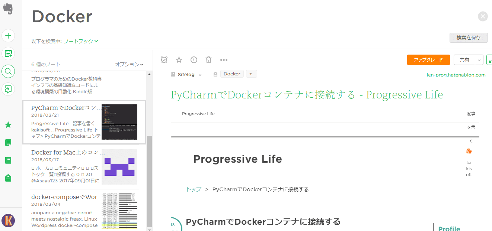
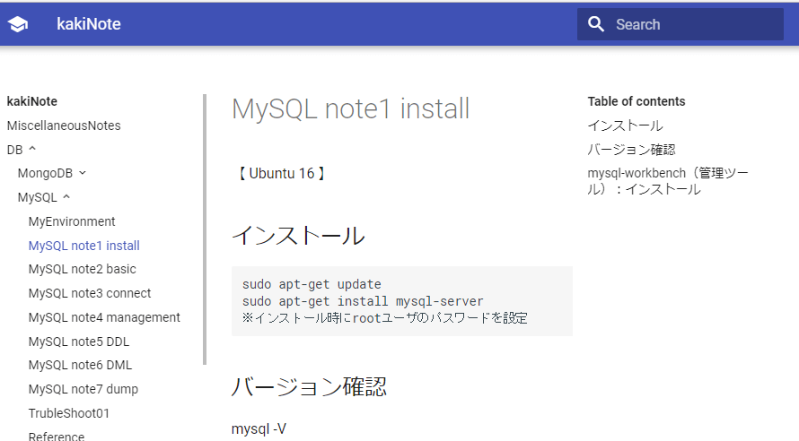
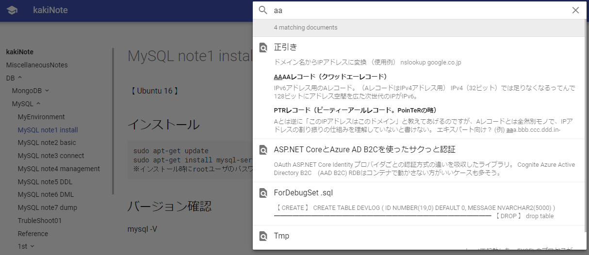

### 俺式情報整理術

 
 
 
 
kakisoft
 

&nbsp;&nbsp;

---

### about me

&nbsp;  |  &nbsp;
-------------|---------------
名前       | 垣花　暁 &nbsp;&nbsp;&nbsp;<small>
仕事        | 物流系エンジニア <small>Laravel/React/AWS etc...</small>  
趣味      | リアル脱出ゲーム
ポートフォリオ | [kakisoft-portfolio](https://kakisoft-portfolio-v2.netlify.com)
Twitte | [kakisoft_tab](https://twitter.com/kakisoft_tab)

---

凄まじいスピードで進化していくIT業界。  
日々、様々な情報が流れて行きます。

---

必要となる情報源にアンテナを張り、  
チェックしていく事も重要ですが、  
それを自分の情報として留めておくことも  
重要ではないかと思います。

---

自分には、こういった事は良くあります。

---

あれ？  
そういえば、以前調べたアレ、  
どんな内容だっけ？

---

そういえば、あのコード、  
どうやって書くんだっけ？

---

・・・という事を、少しでも減らすために、  
自分が工夫している事をつらつら話す  
スライドです。

---

#### 自分における情報整理の目的
　　　
 * 必要な情報を、
 * 必要な時に、
 * 手軽に素早く取り出せる事

---

### １．ブログに書く

---

グローバルメモ帳として、非常に有用。  
書けば、いつでもどこでも取り出せる。  
　  
調べた事を自分の中に整理させておく  
場合にも有用。  
あやふやだった部分を、  
改めて調べ直すきっかけにもなる。

---

#### ためらいがちになる点
　  
 * 確信を持てない情報は書きづらい
 * もっと質の高い記事を見つけてしまった場合、書く気が失せる。

---

### ２．コードを GitHubにブチ込む

---

最初、gistに保存していたが、ファイル数が増えていくと
必要な情報を取り出しづらくなったので、リポジトリにぶち込む事にしました。  
　  
また、カテゴリごとに分けたかった。  

---

サンプルソースや書きかけのコードも、  
気にせず放り込んでます。  
（未完成だろうと、後で読み返したくなるケースがあるので。）

---

誰でも見れる状態になりますが、  
そこは気にしない事にしています。

---

### ３．非公開の情報に Bitbuket を使用

---

無料でプライベートリポジトリ枠があります。

外に公開しない情報、日記やポエム。  
ブログの草案なんかをブチ込んでいます。

<small>※現在は、GitHub も無料でプライベートリポジトリを保持できます</small>
---

「Google Drive とか Drop Boxでもいいんじゃね？」  
という意見もあるかと思いますが、  
履歴管理ができるのは便利です。

---

### ４．整理しきれない情報は  Evernote を活用

---

調べものをしているうちに、  
ブラウザのタブがこうなる事、ありますよね。

  

んで、いつの間にか、そろそろ寝る時間に・・・

---

とりあえず、お気に入りに保存して寝るかー！  
　  
 **⇒カオス化するお気に入りリスト・・・**

---

そんな時、Evernoteが便利です。  
整理しきれないWebページを、どんどん  
放り込みます。  

  

---

放り込んだ後は、  
適当なキーワードで検索可能です。

  

---

Evernoteは、  
　  
「情報を整理しないままブチ込み、  
　雑多な状態のまま取り出す」  
　  
には、非常に便利なツールです。

---

### ５．ある程度整理した情報は  MkDocs を利用

---

#### MkDocs
　  
静的ページジェネレータ。  
jekyll や Sphinx みたいなもの。  
　  
https://www.mkdocs.org/  

---

使い方がシンプル。  
ひな形を作った後、Docsフォルダに  
mdファイルを放り込む。  
GitHubにデプロイするコマンドがある。

---

こんな感じ。（GitHub Pagesにデプロイ）

  

https://kakisoft.github.io/MiscellaneousDocs/

---

検索機能があります。

  

---

「きっちりと整頓はしてないけど、  
　後で読み返したい雑文」  
　  
の保存方法として活用しています。

---

勉強会でメモっておきたい事の走り書きも、  
未完成のままブチ込んでます。  

---

「きっちり整理してまとめよう」  
という行動を諦め、  
雑多なままの状態でも保存しておいて、  
検索は ツールの機能に頼ろう。  
　  
という考えです。

---

・・・こんな感じで、  
整理したい情報の性質に合わせ、  
ちょっとした工夫をしています。

---

皆様は、どんな風に情報を整理し、  
活用しているのでしょうか。

---

「こんな方法があるよ！」といった  
ノウハウがあれば、是非教えて下さい。

---

おわり

