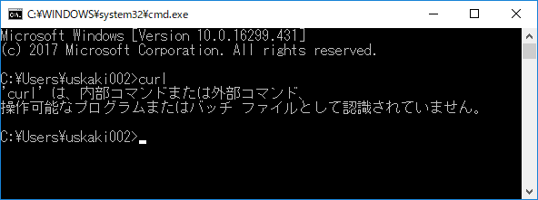
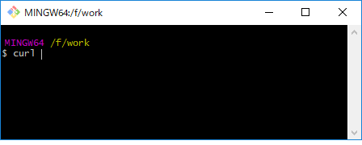

### Windowsユーザに厳しいWebの世界 ～ほとんどのエンジニアには解けるが、下位10％のダメなエンジニアにだけ解けないパズル？～

 
 
 
 
kakisoft
 

&nbsp;&nbsp;

---

### about me

&nbsp;  |  &nbsp;
-------------|---------------
名前       | 垣花　暁 &nbsp;&nbsp;&nbsp;<small>
仕事        | 物流系エンジニア <small>Laravel/React/AWS etc...</small>  
趣味      | リアル脱出ゲーム
ポートフォリオ | [kakisoft-portfolio](https://kakisoft-portfolio-v2.netlify.com)
Twitte | [kakisoft_tab](https://twitter.com/kakisoft_tab)

---

発端はこれ。  
  

http://tango-ruby.hatenablog.com/entry/2015/11/30/122814  

---
#### これは？
 
ベルリンのスタートアップに勤務している日本人エンジニア、[ジャバ・ザ・ハットリ](https://jabba.cloud/)さんが、  
シンガポールに勤務していた頃に作成した、  
候補者を振るいにかけるためのパズル。

---

#### どんなクイズ？
 

API を叩き、いくつかの関門を突破して行けば、  
正解に辿り着けるクイズ。
---

  
curl使えばいいよ！という  
出題者からのヒント。

---

しかし、Windowsでcurlを叩くという行為は、  
実は、それなりにハードルが高い。

---

  

まず、コマンドプロンプトからは使えない。

---

Power Shell 使えば行けるんじゃね？

---

Power Shellの curlは、  
「Invoke-WebRequest」のエイリアスで、  
curlとは挙動が異なる。  
　  
そのためか、第二関門あたりで行き詰り、  
正解までたどり着くことが出来ない。

---

なので、サードパーティ製のツールに  
頼る事になる。

---

  

Postmanを使えば解けます。

---

でも、出題者の意図通り、curlで解いてみたい。

---

#### とりあえず、以下の選択肢。
　  
 * Virtual Boxにインストールした Linuxを使う
 * Windows Subsystem for Linux（旧名：Bash on Ubuntu on Windows）を使う

---

しかし、これだと厳密には  
Windowsを使っているとは言えない。

---

何とか、  
　  
 「Windowsで」  
 「curlを使って」  
　  
解きたい！

---

そして、辿り着いた答え。

---

  

#### git bush！

---

無事に正解に辿り着けました！

---

これなら、インストールされている可能性は  
極めて高い！  
　  
正攻法として使って行けそうだ！

---

こんな感じで、  
「curlでAPIを叩いて、○×△□する」という、  
Webエンジニアにとっては何でもない行為でも、  
Windowsユーザにとっては、  
それなりにハードルが高かったりします。

---

ちなみにこのクイズ、  
Windowsアプリ開発がメインで、  
普段 Windowsしか触らない開発者は、  
**かなり落とせる**と思います。

---

#### その他、Windows辛みポイント
 

* Home Editionでは Dockerが使えない。
* Vagrantを使い、ホストとゲストの共有ディレクトリを作業場所にしていると、npmがコケる。
* pyenvが使えない。

　  
など、開発環境の構築では、苦労が多い印象。
---

という訳で、

---

Mac OS 買いに行くんで、  
誰か付き合ってください！  

---

そして、

---

興味が沸いた方は、是非挑戦してみて下さい！  
　  
　  
#### 『ほとんどのエンジニアには解けるが、下位10％のダメなエンジニアにだけ解けないパズル？』

http://challenge-your-limits.herokuapp.com/  

---

##### ※補足※
現在はWindows10にcurlをインストールできます。  
クイズを解いた 2016年頃は Win7を使ってました。  
　  
後、最近のサードパーティ製のターミナルは　　
bashが使え、curlも使える事が多いので、  
以前ほど苦労する事はありません。  
（以前は bashは使えても、  
curlは使えないツールが多かった。）

---

~~まぁ、Windows には IE というWebエンジニアにとっての敵が居るので、厳しいとか言ってら（略~~

---

おわり
